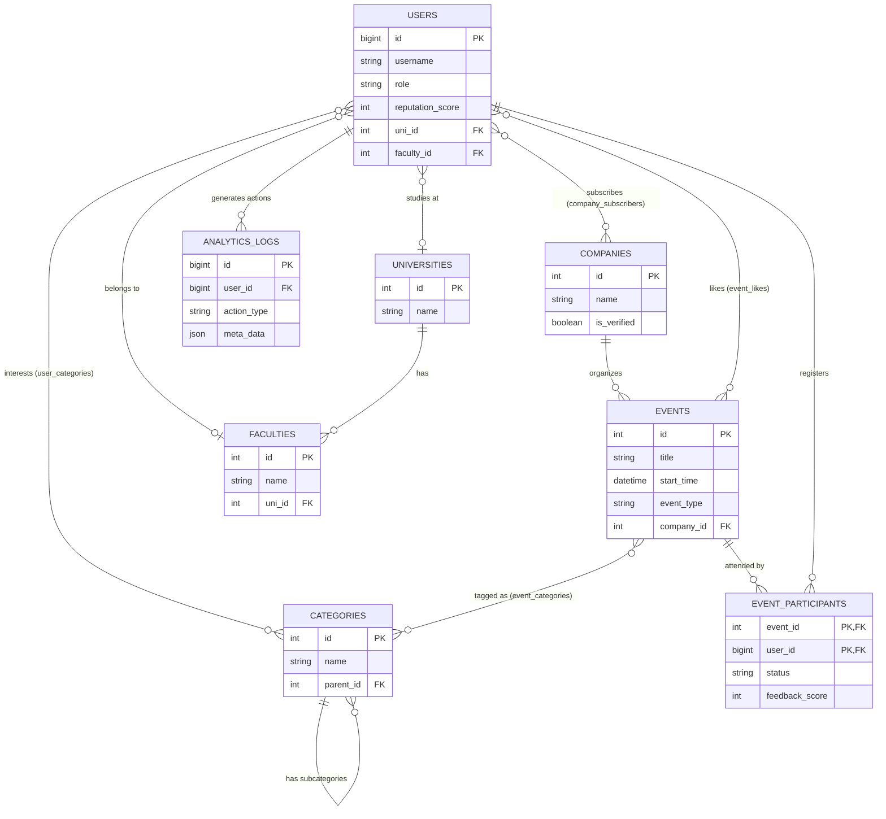

# Portfolio: Product Management & Business Analysis

В данном репозитории представлены два ключевых проекта, демонстрирующие различные аспекты продуктовой разработки: от проектирования сложной backend-архитектуры и AI-автоматизации до data-driven управления юнит-экономикой и поиска Product-Market Fit.

-----

## Проект 1: Upgrade🚀

**Upgrade** — это интеллектуальная экосистема для агрегации, категоризации и персонализированной выдачи студенческих и образовательных мероприятий Минска. Проект решает проблему разрозненности информации об ивентах, предоставляя единое окно (Telegram WebApp) для поиска мероприятий, а также умную систему Push-уведомлений, опирающуюся на интересы пользователя и алгоритмы дедупликации данных.

### 🌟 Ключевые возможности (Features)

  * **AI-Driven Парсинг (Auto-Scraping):** Автоматический сбор сырых данных из Telegram-каналов и веб-сайтов с последующим извлечением структурированной информации через OpenAI API (GPT-4o).
  * **Телеграм-бот и WebApp:** Полноценное веб-приложение внутри Telegram с интерактивной лентой, фильтрами, календарем планирования и личным кабинетом.
  * **Предиктивные уведомления:** Фоновый мониторинг новых ивентов и таргетная рассылка пользователям на основе их интересов и подписок.
  * **Умная дедупликация:** Алгоритмическое сравнение названий мероприятий (коэффициент Сёренсена-Дайса) для предотвращения публикации дубликатов.
  * **Аналитика и логирование:** Сквозное отслеживание пользовательского пути (просмотр → клик → регистрация) с записью JSON-логов в БД для расчета Product Metrics.

### 💼 Бизнес-результаты (Business Impact)

  * **Оптимизация процессов:** Внедрение алгоритмов AI-парсинга сократило среднее время модерации и добавления контента с нескольких часов ручной работы до нуля.
  * **Валидация продукта:** Успешное подтверждение ключевых продуктовых гипотез на ранней студенческой аудитории (Early Adopters).
  * **Защита концепции:** Бизнес-модель, метрики и архитектура были успешно защищены перед стейкхолдерами на открытой питч-сессии от Red Bull.

> 

### 🛠 Технологический стек и Архитектура

  * **Backend & DB:** Python 3.10+, FastAPI, PostgreSQL, SQLAlchemy 2.0.
  * **AI & NLP:** OpenAI API (GPT-4o) для обработки естественного языка и тегирования.
  * **Frontend & Bot:** Aiogram 3.0, HTML5, CSS3, Vanilla JS.

## 🏗 Архитектура базы данных

База данных спроектирована на вырост с жестким разделением сущностей (Third Normal Form):
1.  **Пользовательский блок:** Модели `User`, `University`, `Faculty` с заложенной механикой геймификации (баллы репутации) и связями "Многие-ко-многим" для отслеживания интересов.
2.  **Контентный блок:** Модели `Event`, `Company` (Организатор) и древовидная модель `Category`.
3.  **Блок взаимодействий:** Таблицы `EventParticipant` (запись на ивент с фиксацией обратной связи), `EventLike` (закладки) и `CompanySubscriber` (подписка на организатора).
4.  **Аналитический блок:** Вынесенные таблицы `AnalyticsLog`, `NotificationLog` и `UserScoreLog` для сбора Big Data и построения продуктовых метрик.

## ⚙️ Как работает система парсинга (Data Pipeline)

1.  **CRON/Scheduler:** Демон запускается по расписанию (утро/вечер).
2.  **Extract:** Сбор текста и изображений с целевых площадок через HTTPX и Telethon.
3.  **Transform (AI):** Передача неструктурированного текста в LLM с агрессивным промптом на извлечение ядра ивента (очистка от эмодзи, рекламных хуков, приведение дат к ISO-формату).
4.  **Validate:** Проверка ивента на дубликаты (Global Exact Match + Smart Similarity Threshold 0.65).
5.  **Load:** Сохранение мероприятия со статусом `is_published = False` (требует модерации) и автоматический маппинг на подходящего Организатора и Категории.
6.  **Notify:** При публикации администратором, Background-воркер собирает релевантную базу получателей и производит batch-рассылку.

---
*Проект разработан в рамках демонстрации навыков бизнес-анализа, проектирования архитектуры данных и продуктового менеджмента (создание продукта от идеи до готовой масштабируемой MVP-версии).*

-----

## Проект 2: Zoo Merge Tycoon 🎮

[cite_start]**Zoo Merge Tycoon** — это MVP многопользовательской игры (Roblox UGC) с социальной механикой скрещивания животных[cite: 34]. [cite_start]Главной целью на этапе Soft Launch была валидация геймплейных метрик, поиск масштабируемых каналов привлечения и оптимизация Unit-экономики в условиях жесткого микро-бюджета (Bootstrapping)[cite: 35, 36].

### 📊 Data-Driven Маркетинг и A/B-тестирование

  * **Оптимизация креативов:** Изначальная гипотеза о необходимости сложных креативов, отражающих кор-механику, не подтвердилась[cite: 38, 41]. [cite_start]Был произведен оперативный переход на эмоциональные паттерны (Pet-visuals), что дало рост CTR на 35% и снижение стоимости привлечения (CPP) на \~30%.
  * **Когортный анализ платформ:** Глубокий анализ сессий выявил техническую аномалию: мобильный трафик давал 80% объема, но генерировал высокий технический отток (Churn) и низкий LTV, в то время как PC-пользователи проводили в продукте в 5-10 раз больше времени.
  * **Оптимизация воронки:** Было принято стратегическое решение отключить мобильный трафик ради чистоты данных[cite: 46]. [cite_start]Исключение нецелевой аудитории подняло конверсию Click-to-Play с 20% до 36%.

### 💡 Продуктовая аналитика и Стратегический Pivot

Несмотря на успешную оптимизацию верхней части маркетинговой воронки, продуктовая аналитика подсветила фундаментальную проблему.

  * **Анализ удержания:** Retention Day 1 составил около 1%, а анализ пользовательских сессий показал критический отвал 50% аудитории уже на 90-й секунде.
  * **Root Cause Analysis:** Социальная механика игры требовала синхронного онлайна, однако ограниченный маркетинговый бюджет не позволял купить достаточный объем CCU (Concurrent Users) для оживления сервера, из-за чего новые игроки попадали в пустой мир.
  * **Бизнес-решение:** Чтобы предотвратить дальнейшее сжигание бюджета (Burn rate), убыточная маркетинговая кампания была принудительно остановлена. Доказав неэффективность масштабирования без кратного роста инвестиций, я инициировал стратегический пивот продукта в сторону Single-player механик.

>
