# Product Management & Technical Product Analysis Portfolio

Портфолио продуктовых и аналитических проектов: проектирование финтех-экосистем для коммерческого банка, валидация unit-экономики и запуск data-driven продуктов с автоматизацией на базе LLM.

**Автор:** Максим Цед  
**Специализация:** Product Management / Technical Product Analysis / Unit Economics (Fintech & Banking)  
**Образование:** БГЭУ, «Финансы и кредит» (профиль «Финансовые рынки и  инструменты»), выпуск 2027  
**Контакты:** [Email](mailto:tsedmaksim@gmail.com) · [LinkedIn](https://www.linkedin.com/in/maksim-tsed-745693397) · [GitHub](https://github.com/ethnosOFF)

---

## Проекты в портфолио

| Проект | Доменная область | Роль и фокус | Ключевые артефакты и результаты |
| :--- | :--- | :--- | :--- |
| **[1. iParitet: Инвестиции и криптообмен](#1-сервис-инвестиционные-токены-и-криптообмен-в-дбо-iparitet-оао-паритетбанк)** | Финтех / Банкинг | Lead Product & Business Analyst | BRD v3.0, 6 регламентов BPMN 2.0, 3-летняя финансовая модель (GMV до 67.8M BYN), оценка Lost FTP Margin, интерактивный прототип |
| **[2. Roblox: Zoo Merge Tycoon](#2-zoo-merge-tycoon--soft-launch-analytics--unit-economics-validation)** | GameDev / Mobile | Product Owner / UA Analyst | Сквозная воронка от клика до Churn by seconds, A/B-тесты креативов (CTR 1.37%, CPP $0.023), Click-to-Play 36.8%, Root Cause оттока, Data-driven Pivot |
| **[3. Upgrade: Minsk Event Hub](#3-upgrade-minsk-event-hub--event-aggregator--product-analytics-engine)** | Data Engineering / AI | Full-cycle PM / Lead Dev | ETL-пайплайн 34 источников (Telethon MTProto + HTTPX), GPT-4o нормализация, дедупликация (Сёренсен-Дайс 0.65), когортный D1/D7 Retention по зрелым когортам |

---

# 1. Сервис «Инвестиционные токены и криптообмен» в ДБО iParitet (ОАО «Паритетбанк»)

> **Статус проекта:** Спроектирован полный пакет документации: BRD v3.0, BPMN-регламенты процессов взаимодействия, финансовая модель и интерактивный прототип.  
> **Артефакты:** [Бизнес-требования (BRD)](./брокер/верхнеуровневые_бизнесс_требования.docx) · [Регламенты процессов (BPMN)](./брокер/бизнесс_процессы%20.docx) · [Unit-экономика](./брокер/юнит-экономика.docx) · [Правовое заключение](./брокер/Правовое_обеспечение.docx) · [Интерактивный HTML-прототип](./брокер/Прототип.html)

---

### 1.1. Бизнес-архитектура и партнерская модель (White-Label Gateway)

Продукт представляет собой встраиваемый финансовый раздел в мобильном приложении iParitet, реализующий доступ розничных клиентов Банка к первичному и вторичному рынкам долговых токенов белорусских предприятий и спотовому обмену криптовалют без выхода из доверенного банковского контура.

Интеграция спроектирована по модели **агентского шлюзования (White-Label Gateway)**:

```
┌────────────────────────────────────────────────────────────────────────┐
│                           ОАО «Паритетбанк»                            │
│ - Витрина ДБО iParitet (iOS / Android)                                 │
│ - Первичная аутентификация и идентификация (МСИ / Указ № 478)          │
│ - Фиатный расчетно-клиринговый контур (A2A-платежи в BYN / USD / EUR)  │
│ - AML-фильтрация по реестрам санкций и ограничений (Закон № 165-З)     │
│ - Первая линия клиентской поддержки (L1)                               │
└───────────────────▲────────────────────────────────▲───────────────────┘
                    │ REST API / mTLS                │ REST API / mTLS
                    │                                │
┌───────────────────▼──────────────┐   ┌─────────────▼───────────────────┐
│ ООО «ДФС» (Платформа Finstore)   │   │ ЗАО «Уайт Бёрд» (Whitebird)     │
│ Резидент ПВТ (Декрет № 8)        │   │ Резидент ПВТ (Декрет № 8)       │
│ - Реестр долговых токенов        │   │ - Спотовое котирование          │
│ - Первичный выпуск и учет прав   │   │ - Проверка криптокомплаенса     │
│ - Вторичная P2P-витрина заявок   │   │ - AML-скоринг кошельков         │
│ - Квалификация инвесторов        │   │ - Обмен BTC, ETH, USDT          │
└──────────────────────────────────┘   └─────────────────────────────────┘
```

| Участник | Правовой статус | Зона ответственности | Исключенные риски и функции |
| :--- | :--- | :--- | :--- |
| **ОАО «Паритетбанк»** | Банк (лицензия НБРБ, ст. 14 БК РБ) | Витрина мобильного приложения, ведение текущих счетов клиентов, фиатные A2A-расчеты, комплаенс-фильтрация по Закону № 165-З (ПОД/ФТ), арбитраж сбоев L1. | **Не хранит** токены, криптовалюту и приватные ключи; **не является** стороной по сделкам с цифровыми знаками. |
| **ООО «ДФС» (Finstore)** | Резидент ПВТ (Декрет № 8) | Каталог токенов (ICO), ведение реестра владельцев, обеспечение первичного размещения, поддержка вторичной P2P-витрины заявок, квалификация инвесторов. | Не осуществляет прием депозитов и прямое расчетно-кассовое обслуживание в фиатных валютах. |
| **ЗАО «Уайт Бёрд» (Whitebird)** | Резидент ПВТ, оператор криптообмена (Декрет № 8) | Спотовые котировки (фиксация 30 сек), проведение тестирования рисков инвестора, скоринг кошельков, исполнение конверсий Fiat <-> Crypto. | Не имеет прямого доступа к балансам фиатных счетов клиентов в Банке. |

<p align="center">
  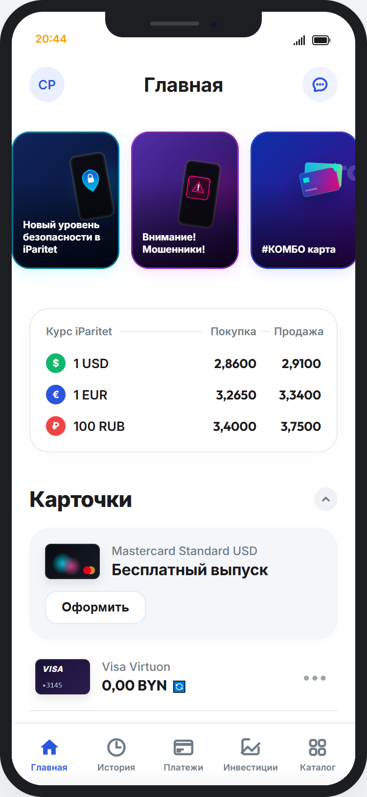
  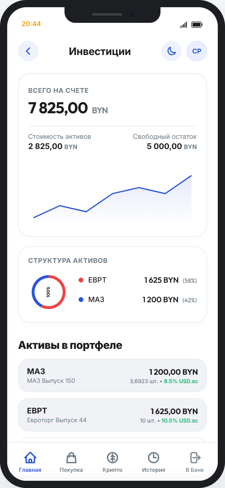
</p>

---

### 1.2. Регуляторный комплаенс и ограничения банковского аутсорсинга

1. **Разграничение банковской правоспособности (ст. 14 БК РБ):** Банк не совершает сделок купли-продажи цифровых знаков от своего имени или за счет клиентов без статуса резидента ПВТ. В договорах B2B и оферте B2C зафиксирован статус Банка исключительно как провайдера информационно-платежного шлюза.
2. **Некастодиальный принцип:** Банк не генерирует, не хранит и не агрегирует приватные ключи или seed-фразы. Внешние кошельки подключаются через передачу публичного адреса (Public Key). Активы на стороне партнера маркируются как «Баланс на платформе партнера».
3. **Режим аутсорсинга IT-функций (Постановление Правления НБРБ № 1):**
   * *Запрет субаутсорсинга (п. 18):* Партнеры ограничены в передаче технологических функций третьим лицам без согласия Банка.
   * *Аудиторский след (Audit Trail):* Закреплено право Нацбанка РБ и службы внутреннего аудита Паритетбанка проводить инспекции IT-инфраструктуры партнеров.
   * *Реестр аутсорсинга:* Договоры включены в ведомственный Реестр договоров аутсорсинга Банка (п. 25).
4. **Раздельные персональные согласия (Закон № 99-З о защите ПДн, ст. 121 БК РБ):** Запрещено объединение согласий. Клиент подписывает независимые электронные формуляры с логированием версии и таймстемпа:
   * Согласие на передачу ПДн и раскрытие банковской тайны в адрес ООО «ДФС» (Finstore);
   * Согласие на передачу ПДн и раскрытие банковской тайны в адрес ЗАО «Уайт Бёрд» (Whitebird);
   * Подтверждение ознакомления с Декларацией рисков и Whitepaper выпусков (регулируется правилами ПВТ по Декрету № 8).

<p align="center">
  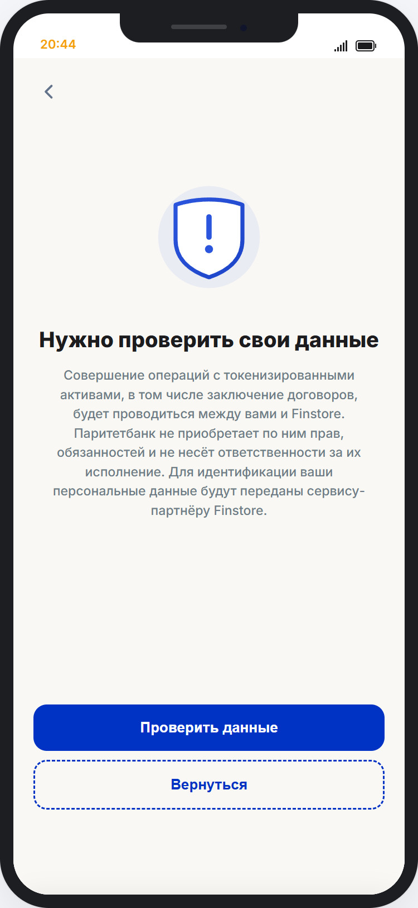
  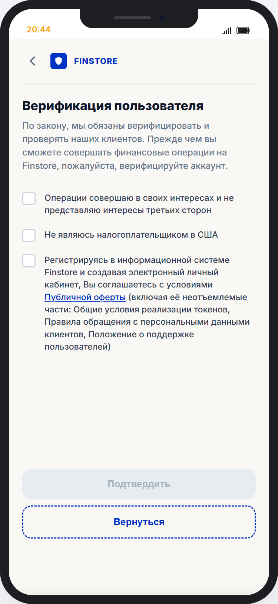
  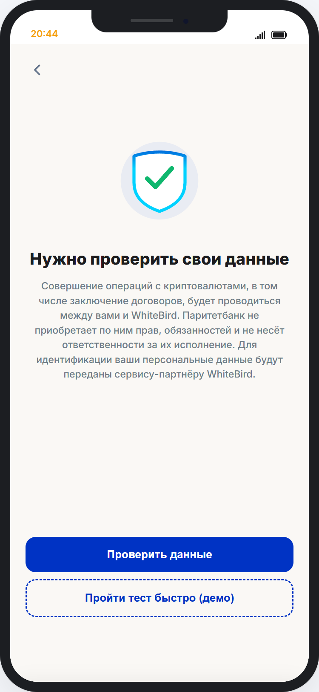
</p>

---

### 1.3. Транзакционные механики и вторичный P2P-рынок

* **Первичный рынок токенов:** Интеграция реестра эмиссий корпоративных долговых токенов (МАЗ, Евроторг и др.). Сегрегация категорий инвесторов: неквалифицированным открыт доступ только к базовым инструментам; статус квалифицированного инвестора требует подтверждения активов > $50 000 в эквиваленте или профильного опыта.
* **AML-проверка по Закону № 165-З (ПОД/ФТ):** На этапе подтверждения сделки ядро Банка в режиме real-time сверяет реквизиты клиента и эмитента со специальным реестром ограничений. При совпадении транзакция мгновенно блокируется комплаенс-фильтром без списания фиата.
* **Вторичный P2P-рынок токенов и калькулятор YTM:** Сделки исполняются на витрине заявок Finstore (комиссия платформы — 0.01% с каждой стороны). В интерфейсе реализован интерактивный слайдер дисконта/премии с динамическим пересчетом доходности к погашению (Approximate **Yield to Maturity, YTM**):

$$\text{YTM} \approx \frac{\text{Купон} + \frac{\text{Номинал} - P_{\text{рын}}}{t}}{\frac{\text{Номинал} + P_{\text{рын}}}{2}} \times 100\%$$

* **Спотовый криптообмен (WhiteBird):** Обмен BTC, ETH, USDT за BYN и USD. Котировка и спред фиксируются на 30 секунд. Встроен тест из 5 контрольных вопросов по Декрету № 8 (волатильность, необратимость блокчейн-транзакций, отсутствие госгарантий).

<p align="center">
  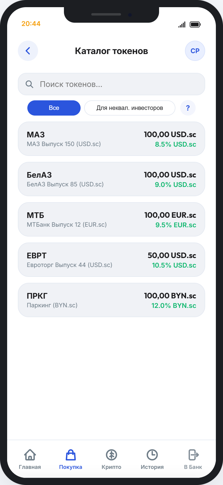
  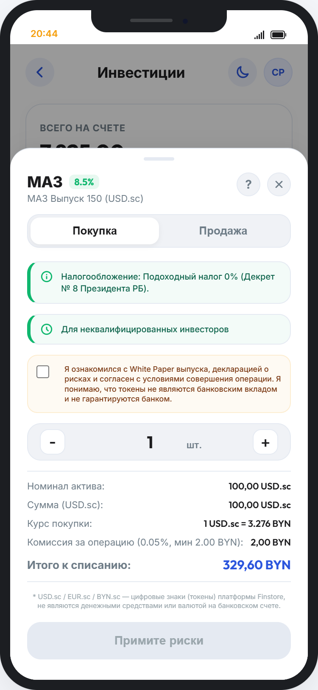
  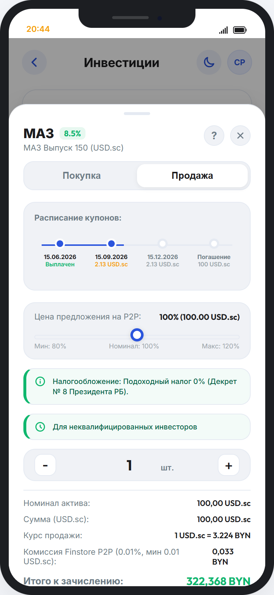
</p>

---

### 1.4. Клиринг, отказоустойчивость и обработка STATUS_UNKNOWN

Для предотвращения разрывов транзакций (деньги списаны со счета в банке, но токены/криптовалюта не начислены партнером из-за сетевого сбоя) разработана схема межсистемного клиринга с защитой от двойного списания:

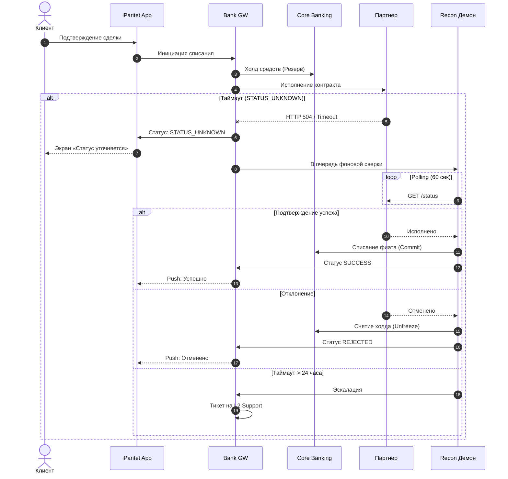

* **Принцип Zero Double-Debit:** При статусе `STATUS_UNKNOWN` кнопка повторной отправки заблокирована до завершения цикла сверки.
* **Холдирование средств:** Фиатные средства не списываются, а резервируются в АБС до подтверждения клиринга контрагентом.
* **Ежедневная сверка (EOD Reconciliation):** Каждый рабочий день в 23:59:59 закрывается реестр фиатных проводок Банка и исполненных сделок партнеров для выявления расхождений.
* **Эскалация на L2:** Транзакции в статусе ожидания >24 часов автоматически передаются операционному офицеру на ручной аудит.

<p align="center">
  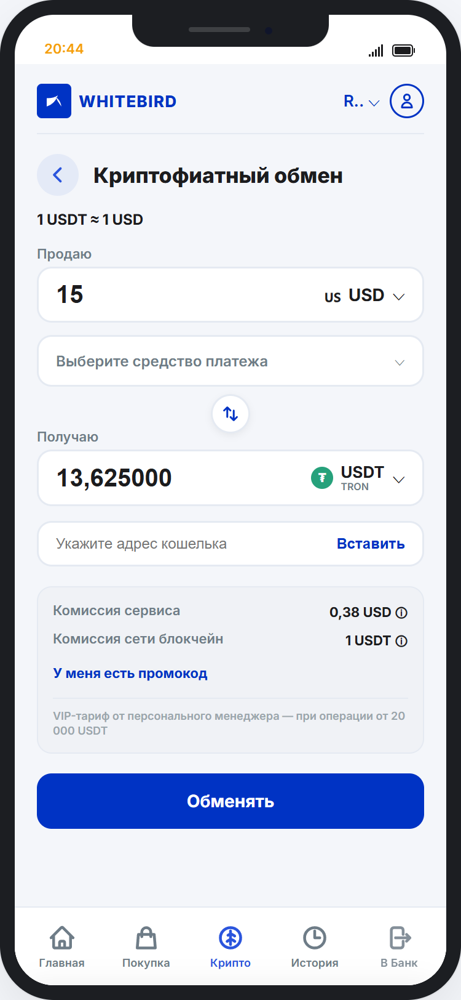
  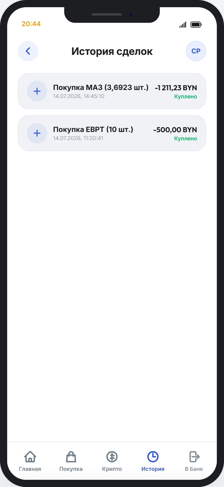
</p>

---

### 1.5. Unit-экономика, риск-менеджмент и коммерческий Term Sheet

#### Анализ рынка (TAM / SAM / SOM)
* **TAM Республики Беларусь:** ~**$3,0 млрд** (~9,7 млрд BYN/год) — оценочный объем внешних транзакций через белорусские криптобиржи и платформы токенизации (экстраполяция $1,7 млрд за 7 мес. 2025 г.).
* **SAM:** ~**1,63 млрд BYN** — легальный годовой оборот партнеров (выручка Whitebird ~1 474 млн BYN + объем размещений Finstore ~158 млн BYN).
* **SOM (Год 3, Базовый сценарий):** **21,64 млн BYN** (~**1,3%** от совокупного оборота партнеров).

#### Трехлетняя сценарная модель (GMV и финансовый результат)
*Переменные транзакционные издержки Банка зафиксированы на уровне 5 bps (0,05%) от GMV. Без учета CAPEX и RUN-затрат:*

| Сценарий | Год 1 (GMV) | Год 2 (GMV) | Год 3 (GMV) | 3-летний GMV | Результат @ 25 bps | Результат @ 50 bps | Результат @ 100 bps |
| :--- | :---: | :---: | :---: | :---: | :---: | :---: | :---: |
| **Консервативный** | 3,42 млн BYN | 6,27 млн BYN | 8,95 млн BYN | **18,64 млн BYN** | +37,28 тыс. BYN | +83,88 тыс. BYN | +177,08 тыс. BYN |
| **Базовый** | 5,95 млн BYN | 13,43 млн BYN | 21,64 млн BYN | **41,02 млн BYN** | +82,04 тыс. BYN | +184,59 тыс. BYN | +389,69 тыс. BYN |
| **Высокий** | 10,43 млн BYN | 21,64 млн BYN | 35,81 млн BYN | **67,88 млн BYN** | +135,76 тыс. BYN | +305,46 тыс. BYN | +644,86 тыс. BYN |

#### Риск каннибализации депозитов (Lost FTP Margin)
* В Базовом сценарии к 3-му году переток ликвидности из безотзывных депозитов в токены Finstore формирует потерю депозитной маржи Банка (**Lost FTP Margin**) в размере **~35,5 тыс. BYN в год**.
* Партнерская ставка 25 bps генерирует за 3 года всего 82,04 тыс. BYN чистой комиссии, что едва компенсирует вымывание трансфертной маржи.

#### Обоснование требований к Term Sheet
1. **Защита 100% GMV-атрибуции (Eligible GMV):** Партнеры стремятся платить только за новых пользователей (New-To-Platform). Учитывая, что клиенты iParitet уже могут иметь аккаунты на биржах, Банк требует фиксации **100% атрибуции любого оборота через iParitet**. Снижение атрибуции до 60% сокращает чистую маржу Банка в 2 раза.
2. **Целевая доходность ~100 bps:** Доля WhiteBird: **30–50 bps** от GMV; доля Finstore: **50–100 bps** первичного размещения; **Issuer-side fee** (комиссия за эмитентов, привлеченных кредитным блоком Банка); доход от A2A-расчетов.
3. **Zero Setup Fee:** Отсутствие фиксированных платежей за интеграцию и поддержку партнерских API.

---

# 2. Zoo Merge Tycoon — Soft Launch Analytics & Unit Economics Validation

> **Статус:** Soft Launch завершен, кампания остановлена на основе данных, сформирован план продуктового пивота.  


---

### 2.1. Контекст и ограничения

- **Продукт:** MVP Roblox-игры с механикой скрещивания питомцев (Breeding) и социальным мультиплеером.
- **География:** Tier-1 (США, Канада, Великобритания, Австралия) в период праздничного пикового CPM.
- **Бюджет:** $50 (Bootstrapping / Lean Validation). Задача — проверить масштабируемость Unit-экономики до привлечения капитала.

---

### 2.2. Эксперименты и оптимизация воронки (Acquisition)

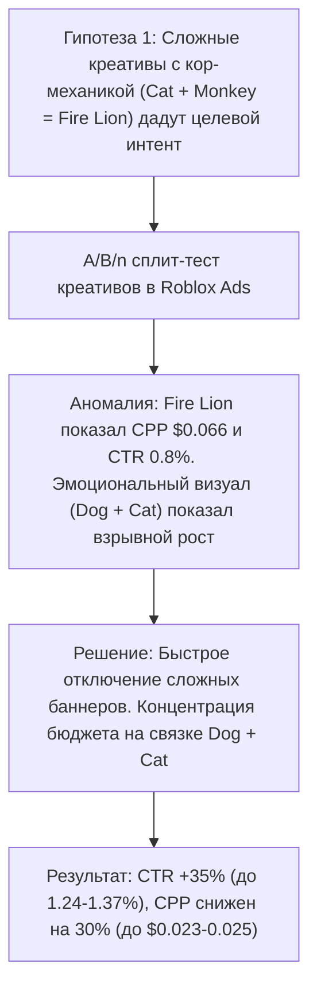

#### A/B-тестирование креативов
* **Тест вариантов:** Вариант A (Огненный лев со спецэффектами) показал **CTR 0.8–0.9%** и **CPP $0.066** (в 2.5 раза выше целевого). Вариант B (Золотой кот) — высокий CPP ($0.035+). Вариант C (эмоциональный визуал «Кот + Собака») показал рост с CTR 0.83% при 5 600 показов до **CTR 1.24%** при 11 800 показов со стабилизацией на **CTR 1.22% при CPP $0.025** (пик — **1.37%**).
* **Решение:** В течение первых 4 часов отключены сложные креативы, бюджет сфокусирован на связке «Кот + Собака».
* **Результат:** Рост CTR на **+35%**, снижение стоимости закупки (CPP) на **~30%** (до $0.023–$0.025).

#### Сегментация по устройствам (Platform Breakdown)
* **Аномалия:** Мобильный трафик обеспечивал 80% показов по низкой цене, но средняя длина сессии на смартфонах составила **0.2 минуты (12 секунд)** из-за проблем с мобильным управлением. На ПК средняя сессия составила **6.0 минут** (03.01) и выросла до **10.37 минут** (04.01).
* **Решение:** Полное отключение смартфонов и планшетов, концентрация на Desktop-сегменте.
* **Результат:** Конверсия клика в реальный запуск игры (**Click-to-Play**) выросла с **20% до 36.76%** (161 игрок из 438 кликов при 52 100 показов).

---

### 2.3. Анализ оттока и обоснование пивота (Root Cause Analysis)

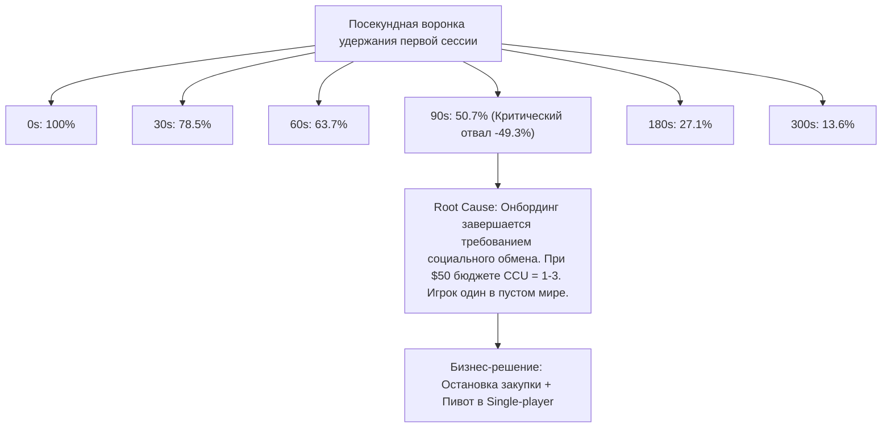

* **Аномалия удержания:** К 90-й секунде в игре оставалось ровно **50.7% пользователей** (отвал почти половины аудитории за 1.5 минуты). К 5-й минуте оставалось **13.57%**. Retention Day 1 рухнул до **~1%** (0.010 на 01.01 и 0.019 на 03.01 при бенчмарке жанра >11%).
* **Root Cause Analysis (5 Почему):**
  1. *Почему отвал на 90-й секунде?* Заканчивается вводный туториал, кор-геймплей требует социального скрещивания с питомцами других игроков.
  2. *Почему игроки не взаимодействуют?* В инстансе нет других пользователей.
  3. *Почему нет пользователей?* Бюджет $50 при распределении по суткам давал средний **CCU (Concurrent Users) = 1–3 игрока на сервер**.
  4. *Итог:* Мультиплеер попал в «эффект пустого сервера» (Ghost Town Effect). Игрок не получал социального подкрепления и покидал игру.
* **Стратегическое решение:** Немедленная остановка закупки трафика для сохранения burn rate. Инициирован пивот кор-геймплея в сторону **Single-Player Autonomous Loop** (NPC-посетители, асинхронное скрещивание без зависимости от онлайна сервера).

#### Сводка метрик эксперимента

| Метрика | До оптимизации / Базовый уровень | После оптимизации / Фактический итог | Импакт решения |
| :--- | :--- | :--- | :--- |
| **CTR (Tier-1 US/EU)** | 0.85% (сложный баннер) | **1.24% – 1.37%** (эмоциональный баннер) | **+35% к кликабельности** |
| **CPP (Cost per Player)** | $0.040 – $0.066 | **$0.023 – $0.025** | **-30% стоимости привлечения** |
| **Сессия (Mobile Phone)** | Cross-platform mix | **0.2 мин (12 секунд)** | Локализован технический отток |
| **Сессия (PC/Desktop)** | Cross-platform mix | **6.0 – 10.37 минут** | **x50 глубина вовлечения vs Mobile** |
| **Click-to-Play CR** | 20.0% (Mobile mix) | **36.76%** (Desktop-only) | **+84% конверсия в запуск геймплея** |
| **Survival Rate (90s)** | Ожидание >70% | **50.7%** (отвал 49.3%) | Найдена точка слома туториала |
| **Forward D1 Retention** | Бенчмарк жанра: 11.0% | **1.04% – 1.96%** | Выявлена нехватка CCU для мультиплеера |

---

# 3. Upgrade (Minsk Event Hub) — Event Aggregator & Product Analytics Engine

> **Статус:** MVP развернут в production, настроен сбор данных из 34 источников и когортная аналитика.  
> **Стек:** Python 3.11, FastAPI, Aiogram 3.0, Telethon, OpenAI GPT-4o, PostgreSQL (SQLAlchemy 2.0 asyncpg), Uvicorn, Sentry.  
> **Репозиторий проекта:** [`./бот/minsk_event_hub`](./бот/minsk_event_hub)

---

### 3.1. Архитектура пайплайна данных (Data Pipeline)

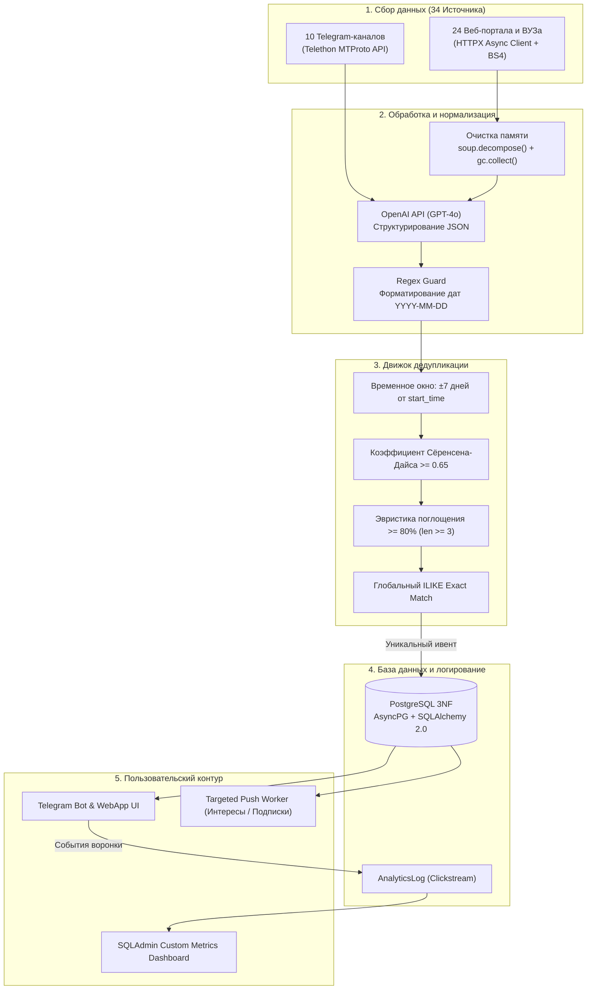

---

### 3.2. Техническая реализация

1. **Парсинг 34 гетерогенных источников (Telethon MTProto + HTTPX):**
   * *10 Telegram-каналов:* нативный парсинг через бинарный протокол **MTProto (Telethon)** с сохранением сессии в `parser_session.session`: официальные каналы университетов (@official_bsu, @bsuir_official, @bntuby, @bseu_official, @bsmu_official), молодежные сообщества и афиши. Глубина сканирования — 30 дней с фильтрацией постов <50 символов.
   * *24 Веб-сайта:* асинхронный клиент **HTTPX** с обработкой редиректов (`follow_redirects=True`). Включает билетных операторов (KudaGo, Relax.by, TicketPro, BezKassira, IT-Event.by) и новостные ленты 12 университетов.
   * *Очистка памяти (Memory Leak Guard):* для стабильной работы демона на серверах с 512 МБ – 1 ГБ RAM внедрена принудительная очистка DOM-деревьев:
     ```python
     soup.decompose()
     del soup
     gc.collect()
     ```
2. **Многоуровневый алгоритм дедупликации (Deduplication Engine):**
   * *Скользящее окно ±7 дней:* первичная выборка ограничивается окном `[full_dt - 7 days, full_dt + 7 days]`, снижая сложность с $O(N)$ до $O(k)$ и нивелируя ошибки LLM в парсинге дат.
   * *Коэффициент Сёренсена-Дайса (порог 0.65):* очистка строк, токенизация на слова $W_1$ и $W_2$:
     $$D(W_1, W_2) = \frac{2 \cdot |W_1 \cap W_2|}{|W_1| + |W_2|} \ge 0.65$$
   * *Эвристика поглощения (Overlap Heuristic):*
     $$\text{Overlap}(W_1, W_2) = \frac{|W_1 \cap W_2|}{\min(|W_1|, |W_2|)} \ge 0.80 \quad \text{при} \quad \min(|W_1|, |W_2|) \ge 3$$
     Отсекает дубликаты вида «Хакатон AI Hack» и «Хакатон AI Hack 2026: Регистрация команд».
   * *Результат:* ручная модерация контента снижена с нескольких часов в неделю до нуля.

---

### 3.3. Продуктовая аналитика: Когортный анализ и воронка конверсий

В `app/main.py` реализован модуль продуктовой аналитики поверх таблицы `AnalyticsLog`:

1. **Когортный анализ D1 и D7 Retention по зрелым когортам (Mature Cohorts):**  
   Для исключения эффекта правой цензуры расчет удержания ведется строго по пользователям, зарегистрировавшимся ранее контрольного срока (`cutoff_1d` и `cutoff_7d`):
   * *D1 Retention:* активность строго на следующий календарный день:
     ```sql
     date_trunc('day', Log.timestamp AT TIME ZONE 'Europe/Minsk') = 
     date_trunc('day', User.created_at AT TIME ZONE 'Europe/Minsk') + INTERVAL '1 day'
     ```
   * *D7 Retention:* возврат строго на 7-й календарный день (исключая скользящие Rolling-окна).
2. **Конверсия воронки карточки (Card-to-Register Conversion):**  
   Трекинг перехода от просмотра деталей к конверсионному действию:
   
   ```sql
   Card_to_Register_CTR = (SUM(ActionType.CLICK_REGISTER) / SUM(ActionType.CLICK_DETAILS)) * 100%
   ```
3. **Smart Push:** Фоновый воркер анализирует дерево тегов мероприятия и подписки на организаторов, отправляя таргетированные пуши с соблюдением Telegram Flood Limits.

---

### 3.4. Модель данных (Entity-Relationship)

База данных спроектирована в Третьей нормальной форме (3NF):

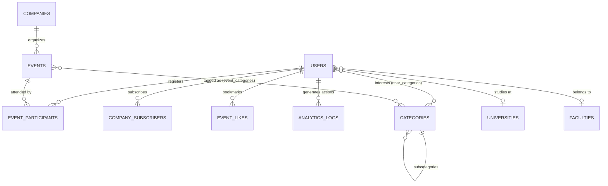

---

## Стек и технические компетенции

- **Product Management:** CustDev, Jobs-to-be-Done, сценарное моделирование (TAM/SAM/SOM), Unit-экономика (LTV, CAC, GMV, Lost Margin, bps), когортный анализ, воронки A/B-тестирования, приоритизация (RICE / ICE).
- **Fintech & Banking:** Регламенты Декрета № 8, Указ № 48 (AML/CFT), Постановление Нацбанка № 1 (банковский аутсорсинг), P2P-рынки долговых токенов, расчет доходности YTM, фиатный клиринг A2A.
- **Бизнес-анализ и архитектура:** BPMN 2.0 (проектирование процессов с обработкой `STATUS_UNKNOWN`), проектирование реляционных баз данных (3NF, ER-диаграммы), разработка BRD / FSD.
- **Разработка и данные:** Python (FastAPI, SQLAlchemy 2.0, Telethon, HTTPX, Pydantic), PostgreSQL (asyncpg, JSONB-логирование), REST API, Telegram WebApp API, OpenAI API (GPT-4o), Docker, Git.
